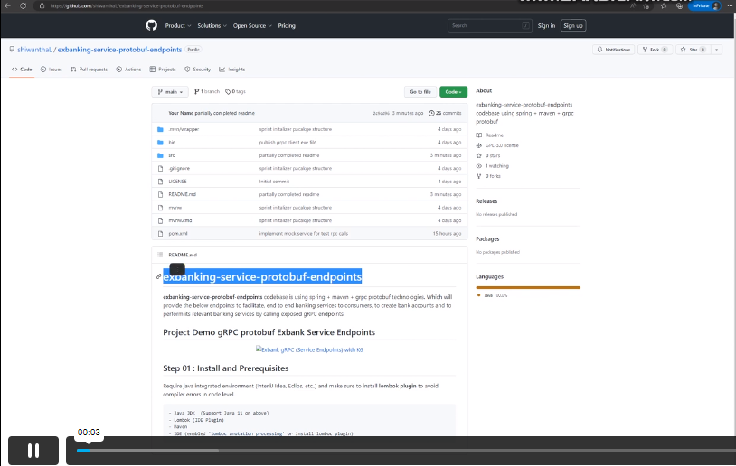

# exbanking-service-protobuf-endpoints
**exbanking-service-protobuf-endpoints** codebase is using spring + maven + grpc protobuf technologies. Which will provide the below endpoints to facilitate, end to end banking services to consumers, to create bank accounts and to perform its relevant banking services by calling exposed gRPC endpoints.
## Project Demo gRPC protobuf Exbank Service Endpoints

<p align="center">
  <a href="https://vimeo.com/manage/videos/789541244">
    
  </a>
</p>

## Step 01 : Install and Prerequisites
Require java integrated environment (InterliJ Idea, Eclips, etc..) and make sure to install **lombok plugin** to avoid compiler errors in code level.
```bash
- Java JDK  (Support Java 11 or above)
- Lombok (IDE Plugin)
- Maven
- IDE (enabled 'lomboc anotation processing' or install lomboc plugin)
```
