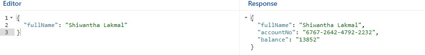

# exbanking-service-protobuf-endpoints
**exbanking-service-protobuf-endpoints** codebase is using spring + maven + grpc protobuf technologies. Which will provide the below endpoints to facilitate, end to end banking services to consumers, to create bank accounts and to perform its relevant banking services by calling exposed gRPC endpoints.
## Project Demo gRPC protobuf Exbank Service Endpoints

<p align="center">
  <a href="https://vimeo.com/manage/videos/789541244">
    
  </a>
</p>

## Step 01 : Install and Prerequisites
Require java integrated environment (InterliJ Idea, Eclips, etc..) and make sure to install **lombok plugin** to avoid compiler errors in code level.
```bash
- Java JDK  (Support Java 11 or above)
- Lombok (IDE Plugin)
- Maven
- IDE (enabled 'lomboc anotation processing' or install lomboc plugin)
```

## Step 02 : Clone gRPC Exbank Service Project
Clone [exbanking-service-protobuf-endpoints](https://github.com/shiwanthaL/exbanking-service-protobuf-endpoints) github project in your running machine
```bash
> git clone https://github.com/shiwanthaL/exbanking-service-protobuf-endpoints.git
```

## Step 03 : Run Exbank Server Endpoints
Generate .proto service DAP classes in build stage
```bash
> mvn clean install
```
Build the .jar package in **.\target** file
```bash
> ./mvnw clean package
```
Execute server .jar in **.\target** file with new bash terminal
```bash
> cd target
> java -jar exbanking-service-protobuf-endpoints-0.0.1-SNAPSHOT.jar
```


## Step 03 : Execute Unit Mock Test
Execute MOCK test-cases by running JUnit Classes in ./test directory


## Step 04 : Execute Endpoint Functionality Check with **BloomRPC**
1. Go to ./bin dir and execute **BloomRPC.exe**
2. Set .proto file path with **import proto** icon 
3. Choose dropdown and create new server env and set  **localhost:9090** then refresh

4. Once config all correct set request as below and validate response details and its connectivity

endpoint /create_user sample request
```bash
{
  "fullName": "Shiwantha Lakmal",
  "email": "shiwantha@gmail.com",
  "passport": "N89730"
}
```


endpoint /balance sample request
```bash
{
  "fullName": "Shiwantha Lakmal"
}
```


endpoint /deposit sample request
```bash
{
  "fullName": "Shiwantha Lakmal",
  "amount": 20000
}
```


endpoint /withdraw sample request
```bash
{
  "fullName": "Shiwantha Lakmal",
  "amount": 500
}
```


endpoint /send sample request
```bash
{
  "fullName": "Shiwantha Lakmal",
  "sender_account": "0029-6542-1292-3132",
  "amount": 1500,
  "remark": "YOLO Transfer"
}
```


## License
[MIT](https://choosealicense.com/licenses/mit/)